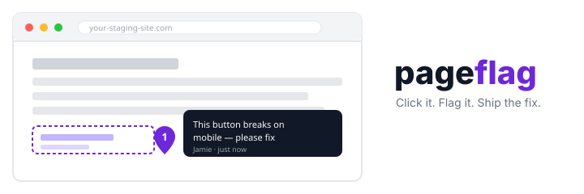
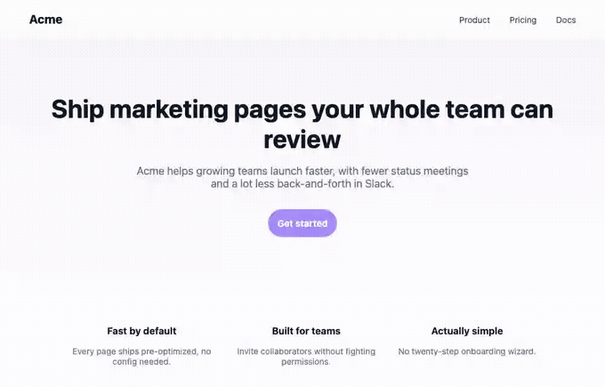

<div align="center">



**Pageflag** — click anything on a live page, leave a comment, and it lands in a
dashboard your team can triage. A self-hosted alternative to BugHerd and
Marker.io: one `<script>` tag, no per-seat fee, and client screenshots stay on
infrastructure you control.

[](https://github.com/Laaaaksh/pageflag/stargazers)
[](#what-it-does)

[](https://github.com/Laaaaksh/pageflag/actions/workflows/ci.yml)
[](https://github.com/Laaaaksh/pageflag/releases)
[](LICENSE)
[](package.json)
[](#install)

**[Install](#install) • [Usage](#usage) • [Configuration](#configuration) • [Changelog](CHANGELOG.md) • [Contributing](CONTRIBUTING.md) • [License](LICENSE)**

**[Code of conduct](CODE_OF_CONDUCT.md) • [Security](SECURITY.md)**

</div>

## What it does

- **A tiny `<script>` snippet** (2KB gzipped) adds a floating feedback button to any page - no browser extension, no build step on the target site.
- **Click-to-pin feedback**: click the button, then click anything on the page, and leave a comment. Pageflag captures the element, page URL, viewport size, browser, and a screenshot of what the reporter actually saw.
- **No account required to report a bug** - anyone who can see the page can leave feedback. Team members log into the dashboard; external reviewers get an unlisted, unauthenticated review link instead.
- **A dashboard your team actually lives in**: every pin, filterable by status, page URL, or reporter, with the auto-captured screenshot right next to the comment.
- **One click to file a real issue** in GitHub Issues or Linear, with the screenshot context baked into the issue body.
- **A per-project domain allow-list** so a copied embed snippet can't be used to capture screenshots of a site you don't control.



## Requirements

- Docker and Docker Compose (the only way this needs to run anything - no other paid or managed service)
- Node.js 22+ and a Postgres database, only if you'd rather run it outside Docker

## Install

```bash
git clone https://github.com/Laaaaksh/pageflag.git
cd pageflag
cp .env.example .env   # fill in JWT_SECRET at minimum - see .env.example
docker compose up -d
```

Open http://localhost:4000, sign up, and create your first project. That's the
whole self-hosted stack: Postgres, the API, the dashboard, and the widget
bundle, all in two containers.

Prefer a pinned image over building from source? Once a tagged release exists,
it publishes to `ghcr.io/laaaaksh/pageflag` - point `docker-compose.yml`'s
`app` service at `image: ghcr.io/laaaaksh/pageflag:vX.Y.Z` instead of
`build: .`. No release has been tagged yet (see
[releases](https://github.com/Laaaaksh/pageflag/releases)); until then,
`docker compose up -d` above builds the image from source, which is the fully
supported path.

## Usage

1. In the dashboard, create a project for the site you want feedback on.
2. Open its **Install** tab and copy the snippet:
   ```html
   <script src="https://your-pageflag-host/widget.js" data-project="pf_..."></script>
   ```
3. Paste it before `</body>` on the pages you want reviewed.
4. Set a domain allow-list under **Settings** before sharing the snippet or a
   review link publicly - see [Configuration](#configuration).
5. Anyone on the page can click the button, click an element, and leave a
   comment. It shows up in the **Pins** tab instantly, screenshot included.
6. Wire up **Integrations** (GitHub or Linear) and turn any pin into a real
   issue with one click.
7. Share a project's unlisted **review link** (Settings tab) with a client who
   shouldn't need a Pageflag account.

## Configuration

Everything is set via environment variables - see [.env.example](.env.example)
for the full list with descriptions. The ones that matter on day one:

- `JWT_SECRET` - required, signs session cookies. Generate one with `openssl rand -hex 32`.
- `DATABASE_URL` - a Postgres connection string; the bundled `docker-compose.yml` sets this up for you.
- `DASHBOARD_ORIGIN` - the dashboard's own origin. Defaults to `http://localhost:4000`, matching
  the Docker Compose stack. If you deploy the dashboard somewhere other than localhost, set this to
  its real origin - it's used both for CORS and for the links back to the dashboard in issues filed
  through the GitHub/Linear integrations.

Per-project settings (domain allow-list, review link, issue-tracker
credentials) live in the dashboard itself, under each project's **Settings**
and **Integrations** tabs - there's nothing to hand-edit in a config file.

## Changelog

Notable changes per release live in [CHANGELOG.md](CHANGELOG.md).

## Contributing

Contributions are welcome. See [CONTRIBUTING.md](CONTRIBUTING.md).

## Security

Found a security issue? Please report it privately - see [SECURITY.md](SECURITY.md).

## Star this repo

If Pageflag saves you a BugHerd or Marker.io bill, [leave a star](https://github.com/Laaaaksh/pageflag/stargazers) - it helps other people find it.

<a href="https://www.star-history.com/?repos=laaaaksh%2Fpageflag&type=date&legend=top-left">
 <picture>
   <source media="(prefers-color-scheme: dark)" srcset="https://api.star-history.com/chart?repos=laaaaksh/pageflag&type=date&theme=dark&legend=top-left" />
   <source media="(prefers-color-scheme: light)" srcset="https://api.star-history.com/chart?repos=laaaaksh/pageflag&type=date&theme=light&legend=top-left" />
   
 </picture>
</a>

## License

MIT - see [LICENSE](LICENSE).
